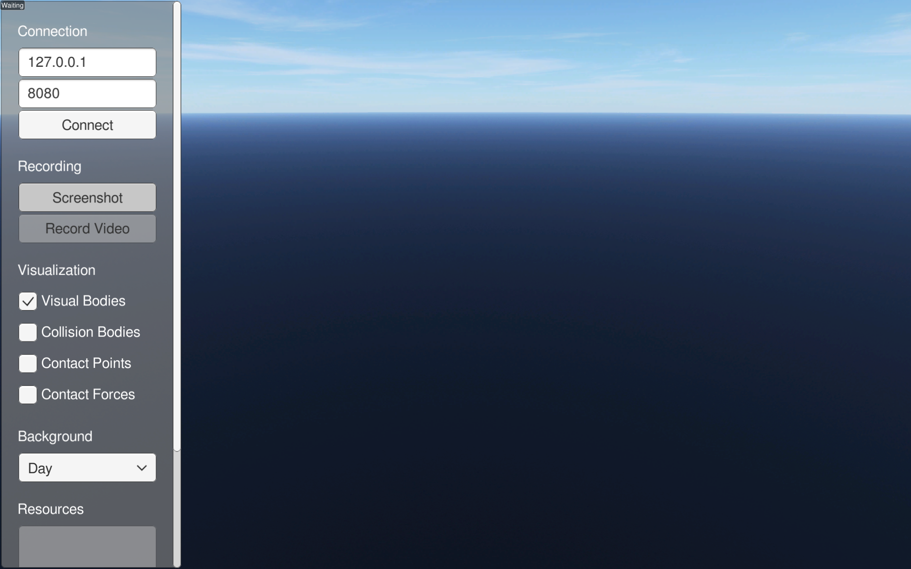
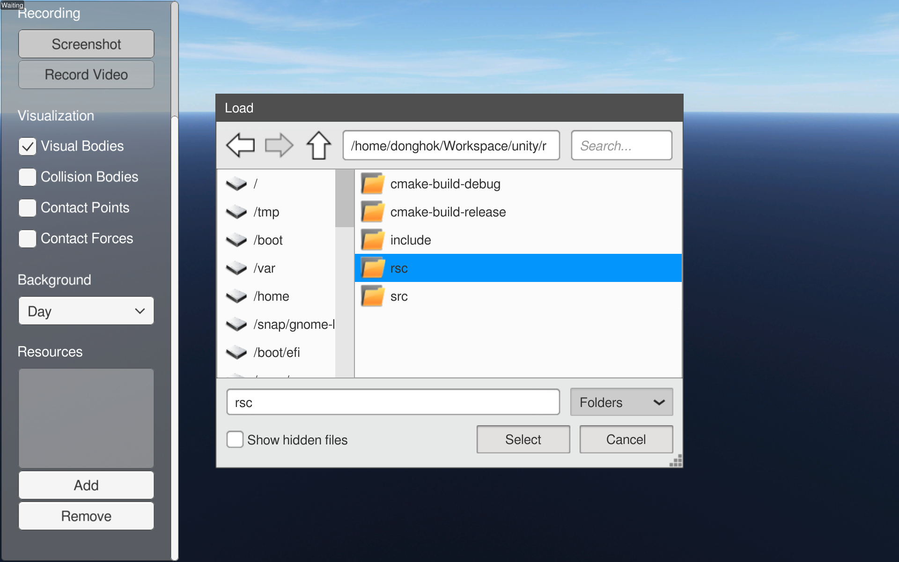
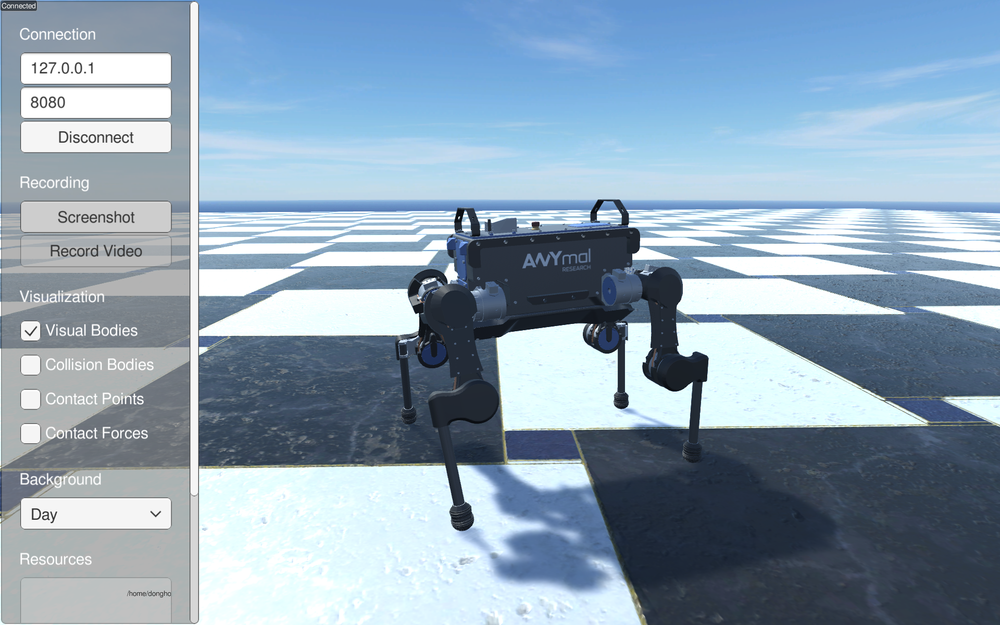
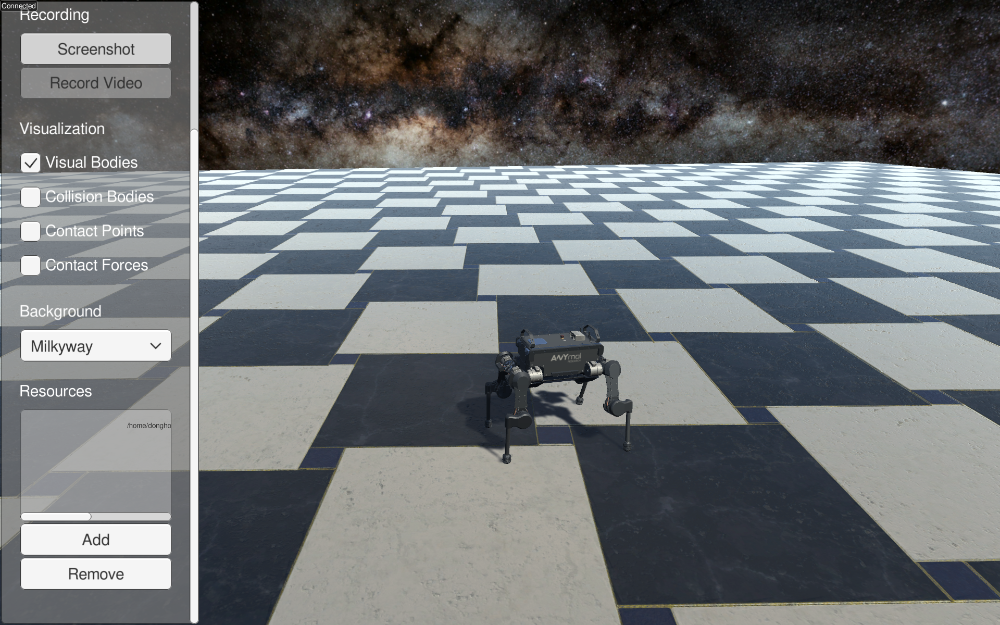

# RaiSimUnity (NOT COMPLETED) 


 
RaiSimUnity is a visualizer for RaiSim based on [Unity](https://unity.com/). It gets the simulation data from raisim server application via TCP/IP.

The project was tested on Ubuntu 18.04 LST.

## How to 

### Dependencies

The following Unity plugins are already included in the project.                
- [SimpleFileBrowser](https://assetstore.unity.com/packages/tools/gui/runtime-file-browser-113006)

The following Unity packages are imported by Unity Package Manager automatically: see [Packages/manifest.json](Packages/manifest.json) 
- [UnityMeshImporter](https://github.com/eastskykang/UnityMeshImporter)

The followings are optional dependencies
- [ffmpeg](https://www.ffmpeg.org/) for video recording
    - You can install ffmpeg by 
        ```sh
        $ sudo apt install ffmpeg
        ``` 

### Quickstart with RaiSim

1. Add the following line in your RaiSim simulation code: see [Example code](https://github.com/leggedrobotics/raisimUnity/tree/master/Examples/src)
    ```cpp
      /// launch raisim server
      raisim::RaisimServer server(&world);
      server.launchServer();
    
      while(1) {
        raisim::MSLEEP(2);
        server.integrateWorldThreadSafe();
      }
    
      server.killServer();
    ```
2. Run your RaiSim simulation. 
3. Run RaiSimUnity application.

4. Add your resource directory that contains your mesh, material etc.

5. Tap *Connect* button after specify TCP address and port.

6. You can change background by *Background* dropdown menu in run time.


### Development

The following sections introduces how to develop RaiSimUnity on Linux (Ubuntu 18.04 LTS). For more details, see [Installation wiki](https://github.com/leggedrobotics/RaiSimUnity/wiki/installation) and [Developing wiki](https://github.com/leggedrobotics/RaiSimUnity/wiki/developing).

#### Getting started

1. Clone this repository with git and [git-lfs](https://git-lfs.github.com/): we use git-lfs for large files such as materials, meshes, texture images etc.
    ```sh
    $ git clone https://github.com/eastskykang/RaiSimUnity.git
    ```
2. Once you cloned source code, get lfs files by 
    ```sh
    $ git lfs pull origin
    ```
    You should see texture JPEG files properly from ```Assets/Resources/texture/cc0/```. 
3. Open the project by Unity Editor >= 2019.2.9
    - You can get Unity Editor for Linux from [Unity Hub for Linux](https://forum.unity.com/threads/unity-hub-v2-0-0-release.677485/?_ga=2.133515342.19804957.1574080929-125858921.1570536365)
    - Once you open the project, [UnityMeshImporter - com.donghok.meshimporter](https://github.com/eastskykang/UnityMeshImporter) is imported automatically.  
4. Write or edit Unity project with Unity Editor and your code editor 
    - We strongly recommend to use JetBrain's Rider IDE and Unity Rider Editor package >= 1.1.2 for programming or debugging. See [this](https://github.com/leggedrobotics/RaiSimUnity/wiki/developing#rider-ide-optional) for more details.

#### Contribution guideline

See wiki for a contribution guideline.

## Material supports

RaiSimUnity has default materials created from [CC0 textures](https://cc0textures.com/) and [Free PBR Materials](https://freepbr.com/) textures.
[Default materials](Assets/Resources/materials/Resources) are included as Resources. You can use default materials as follows: 

```cs
Material material = Resources.Load<Material>(yourMaterialName);
yourGameObject.GetComponentInChildren<Renderer>().material = material;
```

If you want to create your own material, see [Wiki doc](https://github.com/leggedrobotics/RaiSimUnity/wiki/creating-unity-materials).
